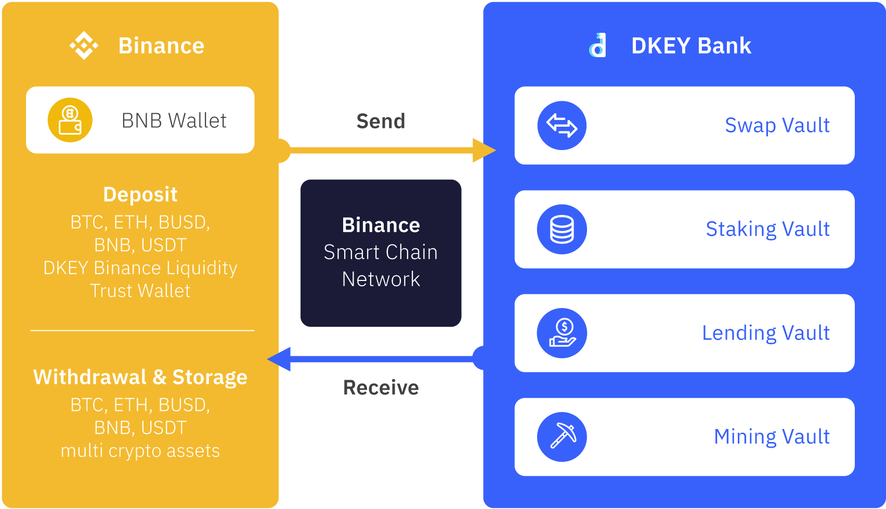

# Protocol Overview ⚙️

### Vault Protocol 🔑 

### **Swap Vault** 🔄 

Swap vault utilizes Binance Smart Chain and Binance Bridge cross-chain functionality to easily swap DKEY Token with any mainstream cryptocurrencies on the market with lower fees and faster settlement.

### **Staking Vault** 🌱 

Staking vault allows investors to take the opportunity to participate in maintaining the blockchain of DKEY \(Token\). In return, the investor received a reward for their participation. Users can deposit their assets into DKEY Bank and stake for passive income. The reward is equally distributed to all stakeholders according to their staking amount.

### **Lending Vault** 🤝 

Lending is also known as crypto loan. Lending vault provides investors with the option to use their existing assets as collateral, whether is cryptocurrencies or traditional assets as borrowing collateral. In an exchange with DKEY \(Token\). Moreover, DKEY Bank is offering “Asset Tokenization” as an option for those who want to utilize their traditional assets for collateral and get liquidated in cryptocurrencies.

### **Mining Vault** ⛏ 

Mining Vault allows investors to earn DKEY \(Token\) with their existing cryptocurrencies. Mining Vault allows user to provide new liquidity for DKEY Bank’s vault services to receive both liquidity provider’s token and DKEY \(Token\) as their rewards.  
  

