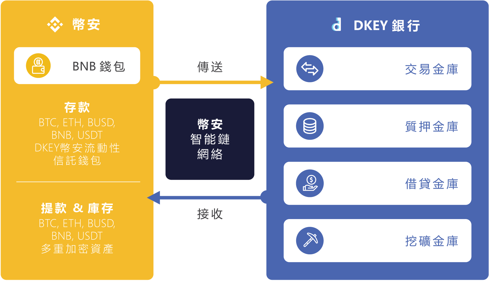

# 協議概述 ⚙️

### 金庫協議 🔑 

### 交易金庫 ****🔄 

交易金庫利用幣安智能鍊和幣安橋跨鏈功能，以更低的費用和更快的結算，輕鬆地將DKEY加密鑰匙\(代幣\)與市場上任何主流的加密貨幣進行交換。

### 質押金庫 ****🌱 

質押金庫允許投資者有機會去參與維護DKEY加密鑰匙上的區塊鏈運行。作為回報，投資者獲得了他們相對參與的報酬。用戶可將他們所持有的資產存入DKEY銀行及質押以獲取被動收入。依據持幣人質押的數額，回報將平均分配予所有的持幣人。

### 借貸金庫 ****🤝 

借貸也可稱為加密貨幣貸款。借貸金庫為投資者提供了抵押其現有資產的選擇，無論是加密貨幣還是傳統資產作為藉貸抵押品都可以與DKEY加密鑰匙\(代幣\)交換。此外，DKEY銀行正在提供“資產代幣化”服務，為那些希望利用其傳統資產作為抵押並以加密貨幣進行清算的用戶提供了選擇。

### 挖礦金庫 ****⛏ 

挖礦金庫允許投資者使用他們其他現有的加密貨幣來賺取DKEY加密鑰匙。挖礦金庫允許用戶作為DKEY銀行金庫新的流動商，提供流動性的加密貨幣和DKEY加密鑰匙，並且以相對應的加密貨幣及DKEY作為他們的獎勵。  
  

