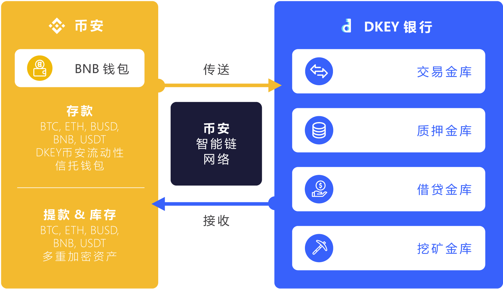

# 协议概述 ⚙️

### 金库协议 🔑 

### **交易金库** 🔄 

交易金库利用币安智能链和币安桥跨链功能，以更低的费用和更快的结算，轻松地将DKEY加密钥匙\(代币\)与市场上任何主流的加密货币进行交换。

### **质押金库** 🌱 

质押金库允许投资者有机会去参与维护DKEY加密钥匙上的区块链运行。作为回报，投资者获得了他们相对参与的报酬。用户可将他们所持有的资产存入DKEY银行及质押以获取被动收入。依据持币人质押的数额，回报将平均分配予所有的持币人。

### **借贷金库** 🤝 

借贷也可称为加密货币贷款。借贷金库为投资者提供了抵押其现有资产的选择，无论是加密货币还是传统资产作为借贷抵押品都可以与DKEY加密钥匙\(代币\)交换。此外，DKEY银行正在提供“资产代币化”服务，为那些希望利用其传统资产作为抵押并以加密货币进行清算的用户提供了选择。

### **挖矿金库** ⛏ 

挖矿金库允许投资者使用他们其他现有的加密货币来赚取DKEY加密钥匙。挖矿金库允许用户作为DKEY银行金库新的流动商，提供流动性的加密货币和DKEY加密钥匙，并且以相对应的加密货币及DKEY作为他们的奖励。  
  

