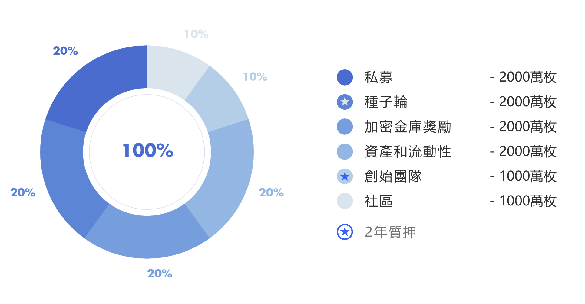

# 分佈與分配⚖️

### 分佈圖  :bar\_chart:&#x20;

### **** ****種子輪:seedling:&#x20;

#### **`20,000,000 DKEY`**

種子輪資金將用作DKEY項目的啟動資金，種子輪的代幣需要2年的鎖定期。

### 私募 :lock\_with\_ink\_pen:&#x20;

#### **`20,000,000 DKEY`**

私募輪由20輪的代幣私募銷售組成，每輪只銷售1,000,000枚DKEY。每枚DKEY的價格將根據市場價格上升，直到所有20輪的私募完成銷售。所有私募輪代幣需要1年的鎖定期。\

### 金庫獎勵:trophy:&#x20;

#### **`20,000,000 DKEY`**

“金庫獎勵”用於獎勵使用DKEY銀行產品和服務的用戶，以提供利息作為回報。通過支持DKEY銀行金融生態，用戶可以通過積累DKEY加密鑰匙(只有在需求上升時才會進一步擴大數量)來獲得質押的回報。前期私募輪銷售質押的代幣將實施採用掛鉤的獎勵模式直到鎖定期結束。隨著開放後越來越多用戶參與，後期將採用DKEY銀行金融生態的收益來獎勵用戶，治理模式將逐步實施。\

### 資產和流動性:moneybag:&#x20;

#### **`20,000,000 DKEY`**

為加強DKEY資產、流動性，並為DKEY建立長期目標(包括傳統和加密資產)的合作夥伴作為交換的資產。將根據當時DKEY成就及合作條件等來建立明確及準確的鎖定期。

### 創始團隊:hatching\_chick:&#x20;

#### **`10,000,000 DKEY`**

將持續支付相對應的數量給開發團隊和顧問，這項獎勵需要2年的鎖定期，並且基於項目的進度和達成目標。\
****

### 社區

#### **`10,000,000 DKEY`**

為社區建設者、吸引新用戶的持續活動，及系統中錯誤發現者提供獎勵。這些明確的鎖定期將**根據當前的成就**所設定。\
