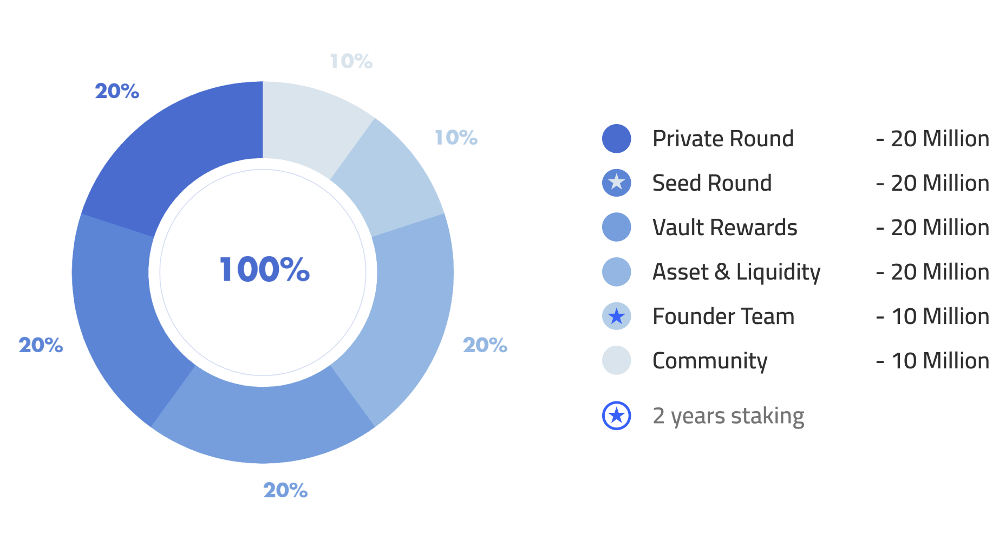

# Distribution & Allocation ⚖️

### Distribution Chart  :bar\_chart:&#x20;

### Seed Round:seedling:&#x20;

#### **`20,000,000 DKEY`**

This portion of funds will be used as start-up funds for the DKEY project. The “Seed Round” token sales will require **2 years locking period** for staking.&#x20;

### Private Round:lock\_with\_ink\_pen:&#x20;

#### **`20,000,000 DKEY`**

The “Private Round” consists of 20 rounds of token sales, each round will only sell a limited unit of 1,000,000 DKEY (Token). The price per DKEY (Token) will increase according to market price until all **20 rounds** are completed. All-round of private token sales will require a **1 year locking period** for staking.

### Vault Rewards:trophy:&#x20;

#### **`20,000,000 DKEY`**

The “Vault Rewards” is used to **pay out a reward** to users who use DKEY Bank products and services that offer interests in return. By supporting the DKEY Bank ecosystem, users are rewarded for their staking collateral by accumulating synthetics that further expand in quantity, only as demand rises. This will be the first implementation of an **adoption-tied reward model**. As more networks adopt DKEY to reward their users, the governance model will be gradually implemented.

### **Assets & Liquidity**:moneybag:&#x20;

#### **`20,000,000 DKEY`**

A reward pool exchanges for partners who strengthen DKEY assets, liquidity and establish for DKEY long term goals, including both **traditional and crypto-assets**.  This will require a certain locking period based on achievement and request for** **a staking locking period.

### **Founder Team**:hatching\_chick:&#x20;

#### **`10,000,000 DKEY`**

A reward pool consistently pays for the development team and advisors, this will require **2 years locking period** based on the project projection and achievement.

### Community:rose:&#x20;

#### **`10,000,000 DKEY`**

A reward pool consistently pays for the community builder, ongoing campaign to attract new users,  and contract bug-finder. This will require a certain locking period **based on the achievement** that had been reached.
