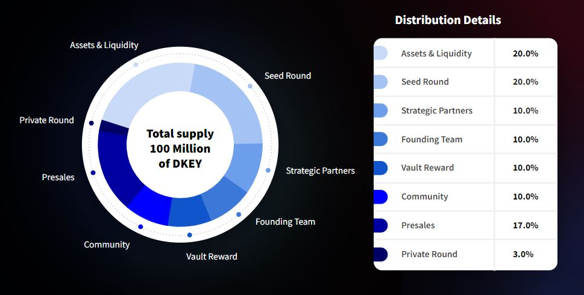

# 💰 Distribution & Allocation

### Distribution Chart  :bar\_chart:&#x20;

### $DKEY Allocation Table

| Allocation         | Percentage | Locking / Vesting Period                                                                                                                                                                             |
| ------------------ | ---------- | ---------------------------------------------------------------------------------------------------------------------------------------------------------------------------------------------------- |
| Seed Round         | 20.0%      | Require 2-year staking locking period and vesting period                                                                                                                                             |
| Private Round      | 2.5%       | Require 1-year staking locking period and vesting period                                                                                                                                             |
| Presales           | 17.5%      | Exchange launchpad and presales events                                                                                                                                                               |
| Assets & Liquidity | 20.0%      | Liquidity locking period based on assets and pool                                                                                                                                                    |
| Vault Reward       | 10.0%      | Implement an adoption-tied reward model to reward users for their staking collateral by accumulating synthetics that expand quantity as demand rises                                                 |
| Community          | 10.0%      | 
A reward pool that provide rewards to community builder, contract bug-finder, and ongoing campaigns to attract new users 

Require a certain locking period based on achievements
 |
| Founding Team      | 10.0%      | Require 2-years staking locking period and vesting period based on the project achievement                                                                                                           |
| Strategic Partners | 10.0%      | Require 2-years staking locking period and vesting period based on the project achievement                                                                                                           |

