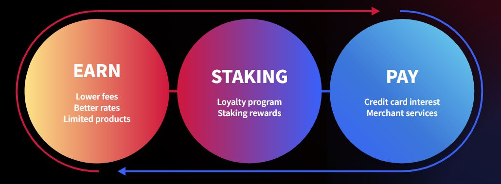

# 🪙 Token Utility

$DKEY is the key to unlocking products and services, payments, as well as ecosystem rewards for stakeholders. Using $DKEY in “EARN” allows users to enjoy lower fees, better rates and even limited financial products. On the other hand, users can use $DKEY in “PAY” to settle payments for credit card interest and merchant services. Users can also stake $DKEY in the loyalty program and gain rewards in return.

