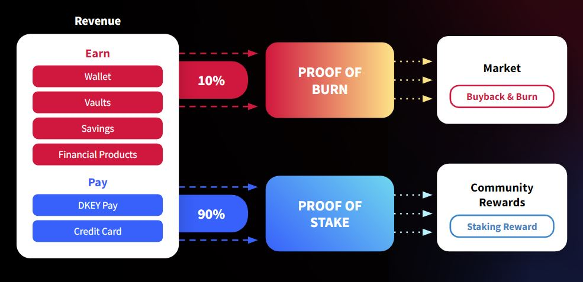

# 💲 Tokenomic Model

### Proof of Stake (PoS)&#x20;

DKEY has selected proof of stake as a consensus algorithm for the $DKEY token model. 10 million $DKEY is allocated as the initial stake pool to incentivize early $DKEY stakeholders. And, 90% of the revenue will be distributed to proof of stake for generating staking rewards. Users are allowed to participate in the governance and securing of the crypto network by locking up some tokens. $DKEY will be released with a decaying emissions schedule. The community will have the right to decide on how they want the economic incentives to be captured by $DKEY.

### Proof of Burn (PoB)&#x20;

DKEY has adopted buyback and burn as a deflationary mechanism to support long-term value growth and price stability of $DKEY. 10% of the revenue will be distributed to proof of burn for market buyback and burn. Burning is also a method of fee distribution, only it boosts the token price more efficiently. This is because burning directly decreases the market supply, thereby increasing the value of the remaining tokens. Conversely, offering protocol earnings to users as rewards often results in users dumping their reward income on the market. Through burn, these earnings are embedded in the token price itself, which discourages selling because users would have to sell part of their principal.

