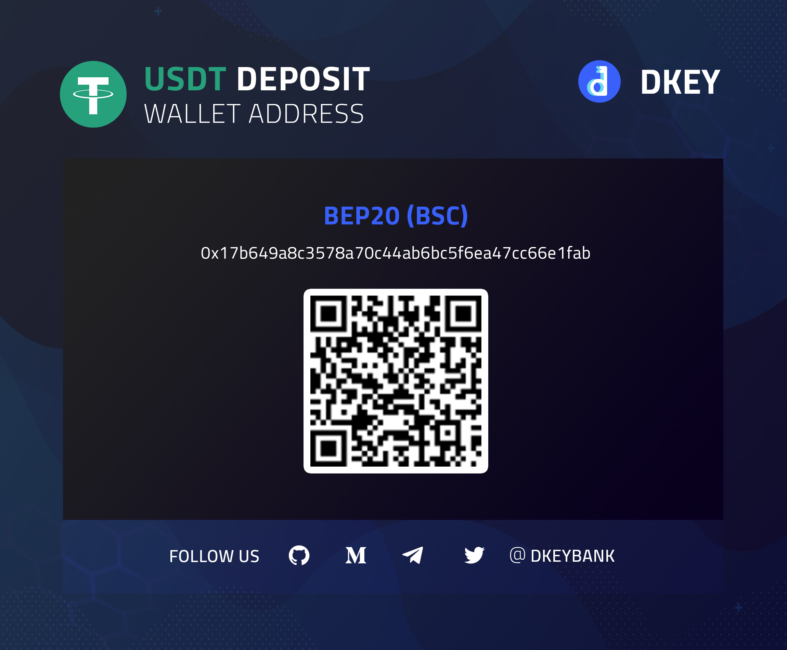
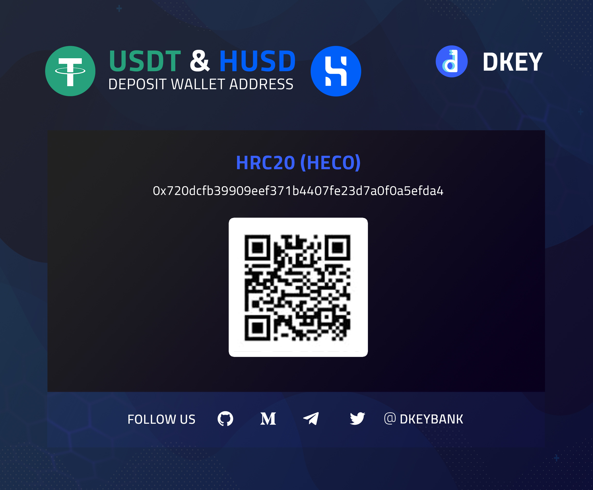

# Private Sales 🎯

## **Binance Private Round Deposit Guide**

1. Register Binance Account at [https://www.binance.com/en/register?ref=109504243](https://www.binance.com/en/register?ref=109504243) 

2. Download Binance App  
   ▶ Login account  
   ▶ Switch to Binance Pro

3. Complete Identity Verification \(KYC\)  
   ▶ Enter personal information  
   ▶ Upload ID and selfie

4. Set up 2-Factor Authentication  
   ▶ Tap "Profile" icon on top left corner  
   ▶ Tap "Security"  
   ▶ Tap "SMS Authentication"  
   ▶ Enter mobile number

5. Purchase USDT  
   ▶ Tap "P2P Trading" on home screen  
   ▶ Select "Express" on top left corner  
   ▶ Tap "Buy"  
   ▶ Tap "USDT"  
   ▶ Enter purchase amount  
   ▶ Proceed to payment  
   ▶ Tap "Transferred, Next"

6. Activate Binance Pay  
   ▶ Tap "Wallets" on bottom right corner  
   ▶ Tap "Pay"  
   ▶ Tap "Open Binance Pay"  
   ▶ Create your unique Nickname  
   ▶ Set your Pay PIN  
   ▶ Tap "Enter Binance Pay"

7. Deposit to DKEY Bank Binance account  
   ▶ Tap "Wallets" on bottom right corner  
   ▶ Tap "Pay"  
   ▶ Tap "Pay"  
   ▶ Enter Pay ID or Email Account / Scan QR code  
   ▶ Tap "Continue"  
   ▶ Select "USDT"  
   ▶ Enter amount  
   ▶ Tap "Confirm"  
   ▶ Tap "Send Now"

_**Please refer to "DKEY Buying & Staking Guide" to complete private sales.**_

🗃 **Binance Pay ID:** 206171867; **Email Account:** [bsc@dkey.io](mailto:bsc@dkey.io)

🗃 **Wallet Address:** 0x17b649a8c3578a70c44ab6bc5f6ea47cc66e1fab

🔑 **DKEY accepts USDT \(BEP20\) deposit**

💵 **Rate:** $1 = 1 USDT

**If you are still confused about the steps to deposit, you may download the document below** 👇🏻 



## Huobi Private Round Deposit Guide

1. Register Huobi Account at[https://www.huobi.pe/en-us/register/?invite\_code=gg7r2223](https://www.huobi.pe/en-us/register/?invite_code=gg7r2223)

2. Download Huobi App  
   ▶ Login   
   ▶ Switch to Huobi Pro

3. Complete Identity Verification \(KYC\)  
   ▶ Enter personal information  
   ▶ Upload ID and selfie

4. Set up 2-Factor Authentication  
   ▶ Tap "Profile" icon on top left  
   ▶ Tap "Security"  
   ▶ Select Phone Number  
   ▶ Enter mobile number

5. Purchase USDT  
   ▶ Tap "Buy" on home screen  
   ▶ Tap "Fiat" on top right  
   ▶ Switch to MYR  
   ▶ Tap "USDT"  
   ▶ Tap "Buy" when you select the best price  
   ▶ Enter purchase amount in fiat  
   ▶ Tap "Order"  
   ▶ Proceed to payment  
   ▶ Tap "Paid" after payment

6. Withdraw to DKEY Bank Huobi account  
   ▶ Tap "Balances"  
   ▶ Tap "Withdraw"  
   ▶ Enter Withdrawal Address  
   ▶ Tap "HECO"  
   ▶ Enter Withdrawal Amount  
   ▶ Tap "Withdraw"

_**Please refer to "DKEY Buying & Staking Guide" to complete private sales.**_

🗃 **Wallet Address:** 0x720dcfb39909eef371b4407fe23d7a0f0a5efda4  
  
🔑 **DKEY accepts USDT \(HRC20\) deposit**

💵 **Rate:** $1 = 1 USDT

**If you are still confused about the steps to deposit, you may download the document below** 👇🏻 



\*\*\*\*

## **DKEY Buying & Staking Guide**

1. Login DKEY Bank App at [https://app.dkey.io/](https://app.dkey.io/)

2. Buy DKEY  
   ▶ Tap "Buy"  
   ▶ Enter required information  
   ▶ Tap "Submit"

3. Stake DKEY  
   ▶ Tap "Staking Vault"  
   ▶ Tap "Earn Now" when you select the desired staking volume  
   ▶ Select where to place the new staking contract  
   ▶ Tap "Confirm"  
   ▶ Tap "Send" to get authorisation code  
   ▶ Enter OTP  
   ▶ Tap "submit"

**If you are still confused about the steps to buy and stake, you may download the document below** 👇🏻 



