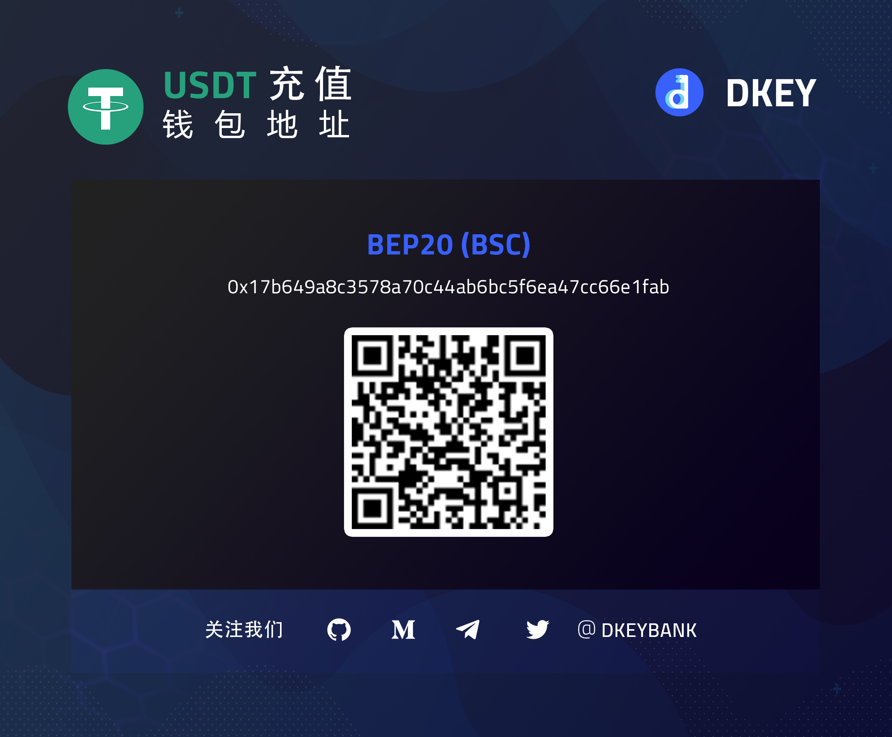
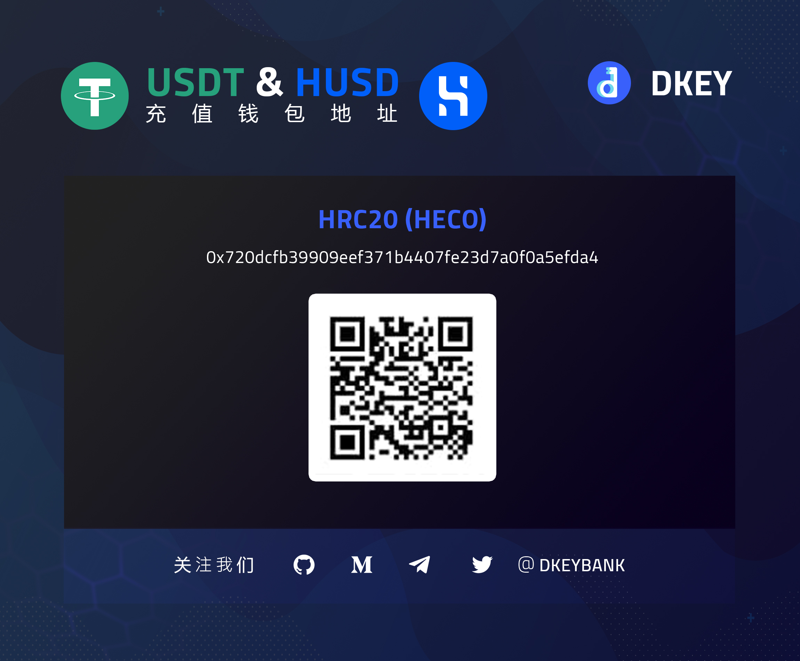

# 私募 🎯

## 币安私募入金指南

1️. 注册币安账号：[https://www.binance.com/en/register?ref=109504243](https://www.binance.com/en/register?ref=109504243)

2️. 下载币安应用  
   ▶ 登录账号  
   ▶ 切换成币安专业版

3️. 核实身份认证  
   ▶ 输入个人资料  
   ▶ 上传身份证和自拍照

4️. 设置双重身份验证  
   ▶ 点击左上角的“个人账户”图标  
   ▶ 点击“安全”  
   ▶ 点击“手机验证”  
   ▶ 输入手机号

5. 购买USDT  
   ▶ 点击主屏幕上的“快捷买币”  
   ▶ 选择左上角的“快捷区”  
   ▶ 点击“我要买”  
   ▶ 点击“USDT”  
   ▶ 输入购买金额  
   ▶ 继续付款  
   ▶ 点击“我已完成付款”

6️. 启用币安支付  
   ▶ 点击右下角的“资金”  
   ▶ 点击“支付”  
   ▶ 点击“开启币安支付”  
   ▶ 设置您独特的昵称  
   ▶ 设置您的支付PIN码  
   ▶ 点击“进入币安支付”

7️. 存入DKEY银行币安账户  
   ▶ 点击右下角的“资金”  
   ▶ 点击“支付”  
   ▶ 点击“付款”  
   ▶ 输入支付ID或邮箱账号 / 扫描二维码  
   ▶ 点击“继续”  
   ▶ 选择“USDT”  
   ▶ 输入金额  
   ▶ 点击“确认”  
   ▶ 点击“确认转账”

_**请参阅“DKEY加密钥匙购买与质押指南”以完成私募。**_

🗃 **币安支付ID：**206171867；**邮箱账号：**[bsc@dkey.io](mailto:bsc@dkey.io)\*\*\*\*

🗃 **钱包地址：**0x17b649a8c3578a70c44ab6bc5f6ea47cc66e1fab

🔑 **DKEY银行接受 USDT（BEP20）入金**

💵 **汇率：**1美元 = 1 USDT

**如若您在私募入金方面还存有疑惑，请点击下载以下指南：**

## 火币私募入金指南

1️. 注册火币账户：[https://www.huobi.pe/en-us/register/?invite\_code=gg7r2223](https://www.huobi.pe/en-us/register/?invite_code=gg7r2223)

2️. 下载火币应用  
   ▶ 登录账户  
   ▶ 切换至火币专业界面

3️. 核实身份认证  
   ▶ 输入个人资料  
   ▶ 上传身份证和自拍照

4. 绑定手机号码  
   ▶ 点击左上角的“个人账户”图标  
   ▶ 点击“安全设置”  
   ▶ 点击“手机”  
   ▶ 输入手机号码

5. 购买USDT  
   ▶ 点击主屏幕上的“立即买币”  
   ▶ 选择右上角的“法币”  
   ▶ 切换至MYR（马币）  
   ▶ 点击“USDT”  
   ▶ 选择最优惠的价格后点击“购买”  
   ▶ 输入购买金额  
   ▶ 点击“下单”  
   ▶ 继续付款  
   ▶ 付款后点击“我已付款成功”

6. 提现至DKEY银行火币账户  
   ▶ 点击“资产”  
   ▶ 点击“提币”  
   ▶ 输入提币地址  
   ▶ 点击“HECO”  
   ▶ 输入提币数量  
   ▶ 点击“提币”

_**请参阅“DKEY加密钥匙购买与质押指南”以完成私募。**_

🗃 **钱包地址：**0x720dcfb39909eef371b4407fe23d7a0f0a5efda4

🔑 **DKEY银行接受 USDT（HRC20）入金**

💵 **汇率：**1美元 = 1 USDT

**如若您在私募入金方面还存有疑惑，请点击下载以下指南：**

## DKEY加密钥匙购买和质押指南

1. 登录DKEY银行应用：[https://app.dkey.io/](https://app.dkey.io/)

2. 购买DKEY加密钥匙  
   ▶ 点击“购买（私募轮）”  
   ▶ 输入转账资料  
   ▶ 点击“确认提交”

3. 质押DKEY加密钥匙  
   ▶ 点击“质押金库”  
   ▶ 选择DKEY加密钥匙质押数量后点击“即时赚取”  
   ▶ 选择放置新合约的位置  
   ▶ 点击“确认”  
   ▶ 点击“发送”以获取验证码  
   ▶ 输入验证码  
   ▶ 点击“确认提交”

**如若您在购买或质押方面还存有疑惑，请点击下载以下指南：**



