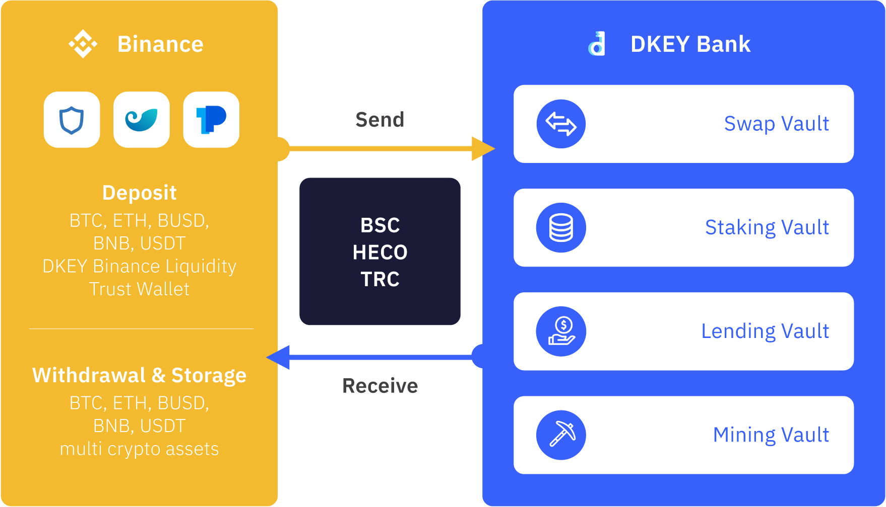

# DKEY Vault

DKEY Vault is an all-in-one DeFi hub that provides comprehensive financial management for all users. It has 4 core financial products i.e., Swap Vault, Staking Vault, Lending Vault, and Mining Vault.

The cross-chain functionality of Swap Vault enables the exchange of $DKEY with other mainstream crypto assets. It provides exchange service with the best market price for available trading pairs, lower fees and faster settlement.

In Staking Vault, stakeholders can gain attractive rewards by buying and holding $DKEY. They can put their idle crypto assets to work even while sleeping.

Lending Vault offers a censorship-free environment whereby anyone can get a loan with crypto assets as collateral. Users can lend their crypto assets to others and earn interest on the loan.

Mining Vault allows users to yield more by putting their crypto assets into shared liquidity mining pools. Rewards are distributed based on their share of the pool's total liquidity.

